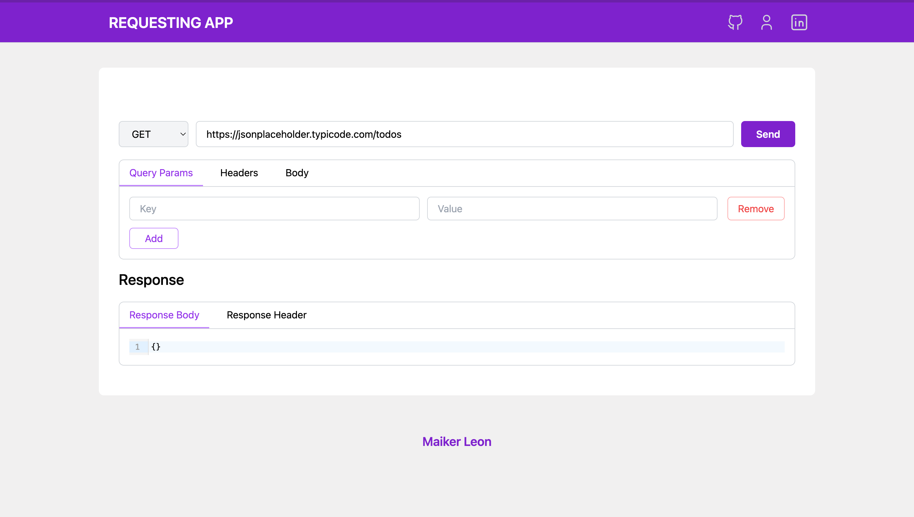

<div align="center">
     
   <h3>
     <strong>Requesting</strong>
   </h3>
</div>

<p></p>

<div align="center">


</div>

## ✨ Installation

1. Clone the repository to your local machine:

```bash
git clone https://github.com/maikerleon/requesting.git
```

2. Access the project folder:

```bash
requesting cd
```

3. Access the project folder:

```bash
npm install
```

## 🛠️Stack

**Projects**:

- HTML, Tailwind CSS, Javascript, CodeMirror, Axios, React.

Http Request Methods - GET, POST, PUT, PATCH, DELETE

## 👑 Contributors

<a href="https://github.com/maikerleon/requesting/graphs/contributors">
   
</a>